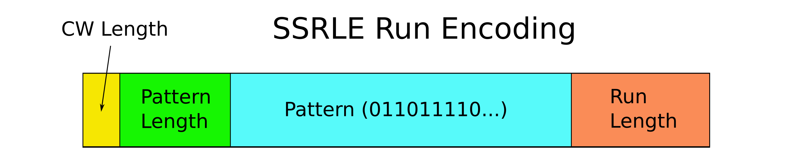

Compressed symbol sequence takes space proportional to the *information* contained in it, not to the number of symbols at the first place. It's achievable via using special encoding and Memoria is using the simplest one -- run-length encoding (RLE). The basic idea is simple: symbol sequence is represented as a *series of short repeatable patterns*. The main challenge is how to encode parameters succinctly in the way that minimizes overhead for poorly compressible sequences.

Currently, the main *family* of compressible sequence encoding in Memoria is called SSRLE or Streaming Symbol RLE. The "streaming" in the name reflects the *intention* to optimize it for streaming applications and hardware acceleration, but otherwise means nothing.

In SSRLE the smallest unit of sequence is "Run" that is pair of *pattern* and its positive *length*. The *pattern* also has positive length. Memory-wise, the smallest element of the sequence is *CodeUnit*, that is currently 2 bytes (16 bits). So the smallest sequence size is 2 bytes. A *CodeWord* is a sequence of *CodeUnit*s of the size from 1 to 4. A Run has to fit into a single CodeWord, that is currently from 16 to 64 bits. A *Segment* is a series of *CodeWord*s up to 32 *CodeUnit*s (64 bytes). *CodeWord* may not cross the boundary of segment. In case of a partially-filled segment, special CodeWord with zero pattern length may be used to denote "padding". If SSRLE is hardware accelerated, Segment may be a unit of processing. 

Specific values for the set above define specific encoding from the *family* of SSRLE encodings.

There are four field in a SSRLE run encoding:

1. **CodeWord length**. Number code units representing CodeWord. Fixed 2 bits for all symbol types, up to 4 code units in a code word.
2. **Pattern Length** (PL). Number of symbols in the pattern.
3. **Symbol Pattern**. Sequence of symbols.
4. **Run Length** (RL). Length of the Run *in patterns*.

SSRLE supports multiple symbol sizes (number of bits per symbol). In Memoria SSRLE is defined for symbol alphabets from 1 to 8 bits per symbol (*BPS*).

For BPS = 1 we have a compressed bitmap (cor compressed bit vector). In this case (code word is up to 64 bits), we need at most 6 bits to represent possible pattern lengths. The longest pattern then is `64-(6 + 2) = 56` bits. So for each 7 bytes of uncomressed bitmap we have 1 byte of *memory overhead*, that is about 14%. SSRLE has rather large (yet acceptable) overhead, comparing to other compressed bitmap encodings. The point is that, unlike other representations, SSRLE supports repeatable patterns, not just long runs of `0...`s and `1...`s.

For larger BPSs we will have different possible values of Pattern Length and Run Length, because symbols are wider in bits and patterns are shorter. The following table summarizes all available variants from different BPPs:

| BPS | PL in Bits | Max Pattern Length (in Symbols)| Max RL in bits |
| --- | ---------- | ------------------------------ | -------------- |
| 1   | 6          | 56                             | 55             |
| 2   | 5          | 28                             | 55             |
| 3   | 5          | 18                             | 54             |
| 4   | 4          | 14                             | 54             |
| 5   | 4          | 11                             | 53             |
| 6   | 4          | 9                              | 52             |
| 7   | 3          | 8                              | 52             |
| 8   | 3          | 7                              | 51             |

Authoritative source for information about actual SSRLE parameters are [sources](https://github.com/victor-smirnov/memoria/tree/master/core/include/memoria/core/ssrle).
