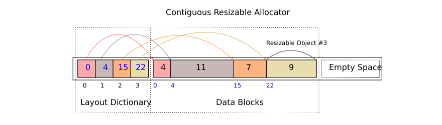
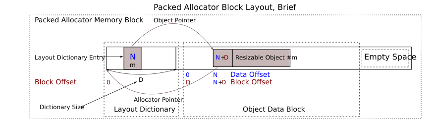
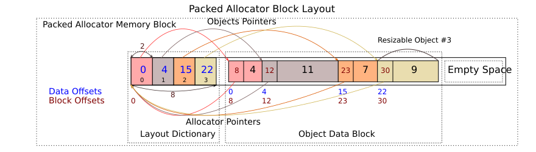
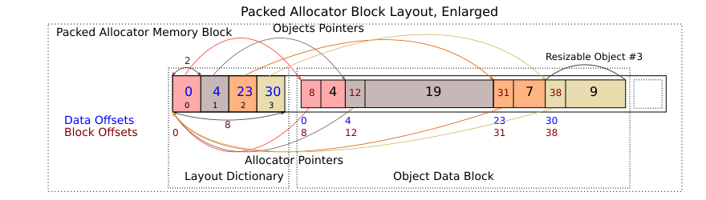

We need to place several, possibly resizable (see below), objects into a single contiguous memory block of limited size. Classical malloc-like memory allocator is not suitable here because it doesn't work well with resizable objects. Especially if they are allocated in a relatively small memory block. To maintain resizability efficiently we have to relocate other objects if some object is resized.

## Resizable Object Pattern

Resizable object is an object that has unbounded size. Usually it has the following pattern:

```c++
class ResizableObject {
  int object_size_;
  char[] variable_size_data_;
};
```

Here, the last member `char[] variable_size_data_` is an unbounded array. For any object `sizeof()` does 
not count the last member if it is unbounded array. For example, `sizeof(ResizableObject) == sizeof(int)`.

If a custom allocator allocates more memory than necessary for resizable objects, this memory can be accessed via the last member. Usually such an object should know length of the memory block it is mapper to. But it can also be stored by memory allocator.

## Linear Contiguous Allocator

The idea is to place all abjects contiguously in a memory block and shift them if some object is resized. Separate layout dictionary is used to locate objects in a block. Objects are accessed by their indexes, not by direct addresses in the block. 

Layout dictionary is an ordered list of block offsets. If dictionary if large, [partial sum tree](/docs/data-zoo/partial-sum-tree) can be used to speedup access.



Layout dictionary is placed into the same memory block as object's data.

## Allocator-Aware Objects

The main property of resizable objects is that their size can be changed dynamically, that requires interaction with allocator. Consider the following example: 

```c++
class ResizableObject {
  //...
  int insert(int index, int value); // enlarge object
  int remove(int index);            // shrink object
  //...
};
```

We have two methods affecting object's size. And it is good to incapsulate required interaction with allocator within resizable objects. But the problem is we don't want to store raw memory pointers to the allocator withing objects for various reasons. The main reason is we want allocators to be relocatable. If the allocator itself is relocated, all pointers have to be updated.

The idea is to put allocator and objects into a single addressable memory block. In this case we can get address of allocator having only address of the object and its relative offset in the memory block. Let's consider `PackedAllocatable` base class for any allocator-aware resizable object:

```c++

class PackedAllocator;

class PackedAllocatable {
  typedef PackedAllocator Allocator;
  int allocator_offset_; // resizable object offset in the allocator's memory block
public:
  Allocator* allocator() {
    if (allocator_offset_ > 0) {
      return reinterpret_cast<Allocator*>(reinterpret_cast<char*>(this) - allocator_offset_);
    }
    else return nullptr;
  }

  // Other methods go here...
};

```

See the following figure how it may look like:



In Memoria we call such allocator _packed_, because it packs all objects and itself into single self-sufficient memory block that can be relocated or serialized. That doesn't affect relative positions of objects within the memory block.

Each allocator-aware resizable object must derive from `PackedAllocatable` class that maintains relative offset of an object to the allocator. The following figure explains it in greater details:



Here we have four resizable objects with sizes 4, 7, 11, and 9 respectively. Each object maintains its relative offset in the memory block, that is converted to a pointer to the allocator.

Let's increase object #1 by 8 units:



We need to perform the following operations for objects #2 and #3.

1. Shift objects' data right by 8 units.
2. Increase objects' offsets in layout dictionary by 8 units.
3. Increase `PackedAllocatable::allocator_offset_` by 8 units.

Not all abjects are resizable, they don't need to maintain a pointer to the allocator. But now allocator has to know which objects are instances of `PackedAllocatable` and which are not to update pointers properly.

## Recursive Allocator

The next idea is to define packed allocator recursively by deriving from `PackedAllocatable`. 

```c++
class PackedAllocatable {/*...*}; // maintains a managed pointer to packed allocator

class PackedAllocator: public PackedAllocatable {
public:
  //...
};
```

In this case it is possible to embed any packed allocator into another allocator just as any resizable object. 

## PackedAllocator API

So we have:

1. `PackedAllocator` managing resizable memory regions withing contiguous relocatable memory block.
2. Allocator-aware objects derive from `PackedAllocatable`.
3. Packed allocator also derives from `PackedAllocatable` that mean it can be embedded into another packed allocator.

The last idea is to use `PackedAllocator` as a base class for resizable objects. That enables them to have more than one resizable section.

The following code snippet explains basic PackedAllocator API:

```c++
class PackedAllocatable {/*...*}; // maintains a managed pointer to packed allocator

class PackedAllocator: public PackedAllocatable {
public:
  //...

  template <typename T>
  T* get(int i);             //returns address of i-th memory block, i = 0...
  template <typename T>
  const T* get(int i) const; //returns address of i-th memory block, i = 0...

  template <typename T>
  T* allocate(int i, int size); // allocates size bytes for i-th memory block and initializes
                                // it properly if T derives from PackedAllocatable.

  template <typename T>
  T* allocate(int i); // Allocates space for i-th memory block and initializes
                      // it properly if T derives from PackedAllocatable. 
                      // Size of the block is got via T::empty_size() if T derives 
                      // form PackedAllocatable and sizeof(T) otherwise.

  // resize memory block at address 'addr', resize parent allocator if necessary
  // throws PackedOOMException if top-most allocator runs out of memory
  void resize(const void* addr, int new_size); 

  //the same as above but returns size of i-th block in bytes
  void resize(int i, int new_size);

  int size(int i) const; 

  void init(int entries); // initializes allocator with the specified number of 
                          // empty blocks (entries)
 
  // returns size in bytes of empty allocator having specified number of entries
  static int empty_size(int entries); 

  static int round(int size); // round size to alignment blocks. e.g. if alignment block is 8 bytes
                              // round(1) = 8; round(12) = 16

  //...
};
```

To interact with PackedAllocator each allocatable object provides two methods. One of them is for initialization, and another one is to query object size:

```c++
class SimpleResizableObject: public PackedAllocatable {
public:
  
  // initialize the object
  void init();
  
  // returns smallest size of the object in bytes
  static int empty_size();
};

class AdvancedResizableObject: public PackedAllocator {
public:
  
  // initialize the object
  void init();
  
  // returns smallest size of the object in bytes
  static int empty_size();
};
```

Note that resizable objects must be [trivial](http://en.cppreference.com/w/cpp/types/is_trivial).

Note also that Memoria doesn't currently use placement [new](http://en.cppreference.com/w/cpp/memory/new/operator_new) и [delete](http://en.cppreference.com/w/cpp/language/delete).

```c++
// There is no way to specify custom allocator and other parameters here, only address 
// of the object to delete. PackedAllocator does not allow to get allocator address given
// only address of a block it manages. so it provides explicit API for allocation 
// and deallocation.

void operator delete (void *ptr); // placement delete operator
```

See this [source](https://github.com/victor-smirnov/memoria/blob/master/include/memoria/core/packed/tools/packed_allocator.hpp) for more details about PackedAllocator implementation.

## Resizable Object Example: Seachable Sequence

Let's consider a relatively simple but live example: [searchable sequence](/docs/data-zoo/searchable-seq). It is a sequence of symbols providing rank and select operations performed in logarithmic time. To provide such time complexity, data structure uses additional index that have to be quite complex for large alphabets. Let's say that in general case the index is compressed and we don't know it's actual size ahead of time. The size of index is a variable value depending of a sequence content.

So the sequence has at least two resizable blocks: index, and symbols.

Below there is a code snipped explaining how update operations on the object interact with its allocator(s).

```c++

template <int BitsPerSymbol>
class SearchableSequence: public PackedAllocator {
  typedef PackedAllocator                              Base;
  typedef SearchableSequence<BitsPerSymbol>            MyType;

  typedef unsigned int                                 Symbol;

  // Instantiate index only if the sequence is larger
  // than this value.
  static const int IndexSizeThreshold                  = 64;

  // no members should be declared here
  // use Metadata class instead
public:
  class Metadata {
    int size_;
    int& size() {return size_;} 
    const int& size() const {return size_;} 
  };

  class Index: public PackedAllocator {
    // index data structure for this SearchableSequence
  };

  // This enum codes memory block indexes.
  enum {
    METADATA, // Metadata block
    INDEX,    // Indexes block
    SYMBOLS   // Symbols block
  };

  // returns address of Metadata object
  Metadata* metadata() {
    return Base::template get<Metadata>(METADATA);
  }
  const Metadata* metadata() const {
    return Base::template get<Metadata>(METADATA);
  }

  // returns address of Index object
  Index* index() {
    return Base::template get<Index>(INDEX);
  }
  const Index* index() const {
    return Base::template get<Index>(INDEX);
  }

  // returns address of symbols block
  Symbol* symbols() {
    return Base::template get<Symbol>(SYMBOS);
  }
  const Symbol* symbols() const {
    return Base::template get<Symbol>(SYMBOS);
  }
  
  // returns size in bytes of empty sequence. this method is used by 
  // PackedAllocator::allocateEmpty(int) to get object's default size
  static int empty_size() 
  {
    int allocator_size = Base::empty_size(); // size of allocator itself
    int metadata_size  = Base::round(sizeof(Metadata)); // size of metadata block
    int index_size     = 0; // index is empty for empty sequence
    int symbols_size   = 0; // symbols block is also empty for empty sequence

    return allocator_size + metadata_size + index_size + symbols_size;
  }

  void init() 
  {
    Base::init(3); // the object has three resizable sections.
    
    // Allocate metadata block and initialize it
    Base::template allocate<Metadata>(METADATA);

    // Allocate empty block for index. Do not initialize it
    Base::template allocate<Index>(INDEX, 0);
    
    // Allocate empty block for symbols. 
    Base::template allocate<Symbol>(SYMBOLS, 0);    
  }

  // change the value of idx-th symbol
  void setSymbol(int idx, int symbol);

  // insert new symbol at the specified position
  int insert(int idx, int symbol) 
  {
    enlarge(1);              // enalrge SYMBOLS block
    insertSpace(idx, 1);     // shift symbols
    setSymbol(idx, symbol);  // set new symbol value

    reindex();               // update search index
  }

  int size() const 
  {
    return metadata()->size();
  }

  // update index for the searchable sequence
  void reindex() 
  {
     // check if the sequence if large enough to have index
     if (size() > IndexSizeThreshold) 
     {
       if (Base::size(INDEX) == 0)
       {
         Base::template allocate<Index>(0); // create empty index if it doesn't exist
       }

       Index* index = this->index();

       // compute index size for given symbols and resize the index.
       index->resize_for(this->symbols(), size());

       // rebuild the index
       // note that any resize operation invalidates pointers to blocks
       // going after the resized one.
       index->update(this->symbols(), size());
     }
     else {
       // the sequence if not full enough to have the index,
       // free it.
       Base::resize(INDEX, 0); // free index block
     }
  }
  
private:
  // insert empty space into symbols's data block,
  // shift symbols in the range [idx, size()) 'length' positions right.
  void insertSpace(int idx, int length);

  // returns symbols block size for specified number of symbols
  static int symbols_size(int symbols);

  //enlarge symbols block by 'items' elements.
  void enlarge(int items) 
  {
    // get new size for SYMBOLS block
    int new_symbols_size = MyType::symbols_size(size() + items)
    
    // enlarge SYMBOLS block
    Base::resize(SYMBOLS, new_symbols_size);
  }
};
```

This pattern is used intensively for packed data structures in Memoria.
