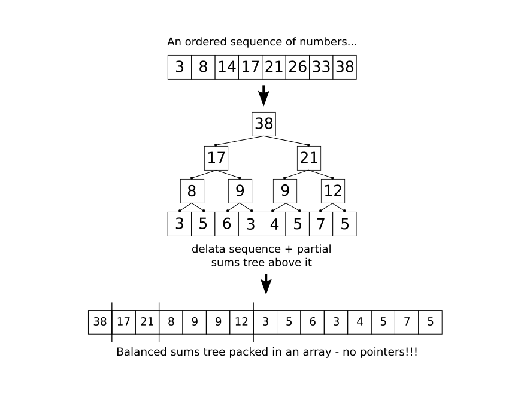

Let's take a sequence of monotonically increasing numbers, and get delta sequence from it, as it is shown on the following figure. Partial Sum Tree is a tree of sums over this delta sequence.

 

Packed tree in Memoria is a multiary balanced tree mapped to an array. For instance in a level order as it shown on the figure.

Given a sequence of N numbers with monotonically increasing values, partial sum tree provides several important operations:

* `findLT(value)` finds position of maximal element less than `value`, time complexity $T = O(log N)$
* `findLE(value)` finds position of maximal element less than or equals to `value`, $T = O(log N)$.
* `sum(to)` computes plain sum of values in the delta sequence in range [0, to), $T = O(log N)$
* `add(from, value)` adds `value` to all elements of original sequence in the range of [from, N), $T = O(log N)$.

It is obvious that first two operations can be computed with binary search without partial sum tree and all that overhead it introduces. 

