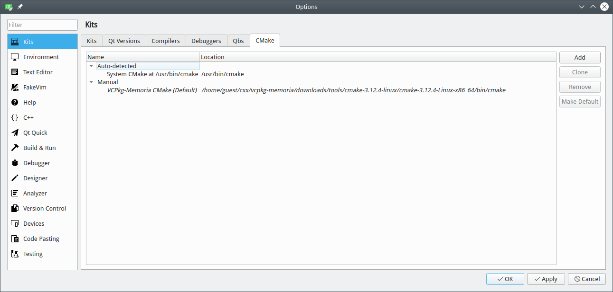
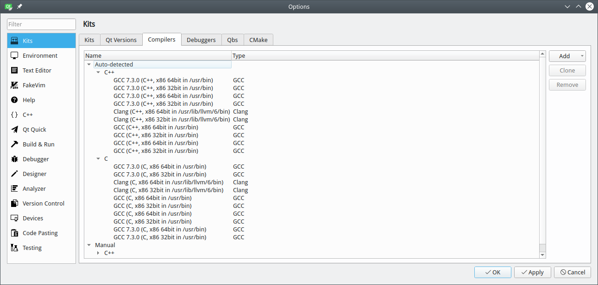
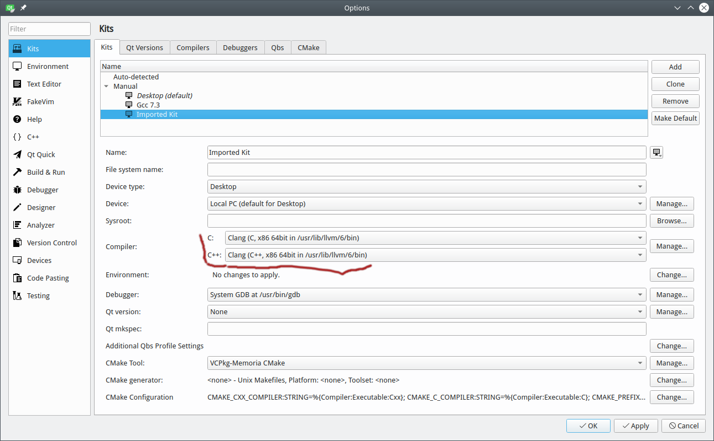
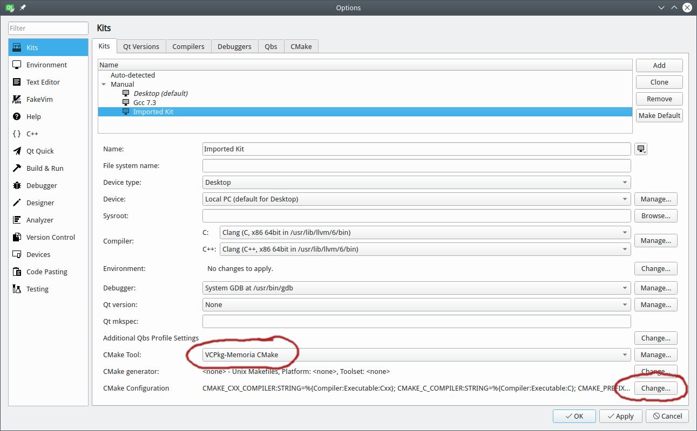
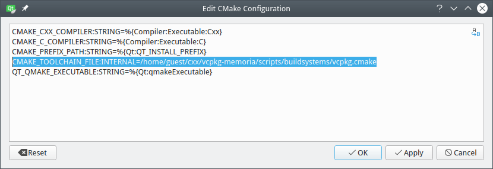
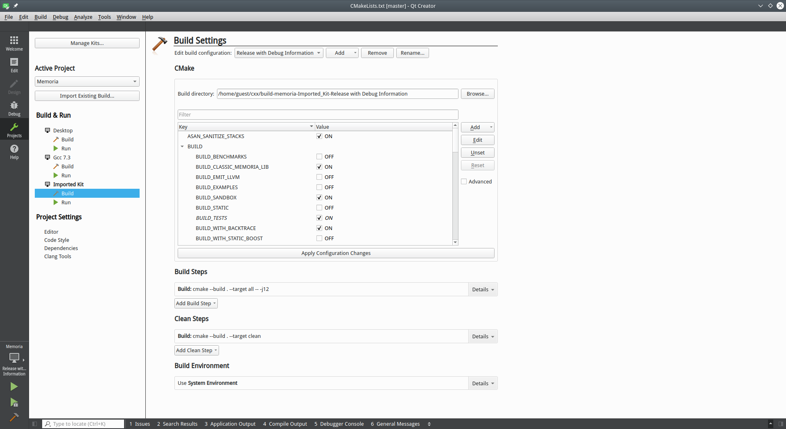

## Build and install VCPkg for Memoria

```!console
# Assuming current folder is /home/guest/cxx
$ git clone https://github.com/microsoft/vcpkg.git
$ cd vcpkg
$ ./bootstrap-vcpkg.sh
$ ./vcpkg install boost icu abseil yaml-cpp fmt
```

## Configuring VCPkg's provided cmake tool

In Options/Kits/Cmake tab add another cmake configuration by specifying full path VCPkg's own cmake distribution. 



## Configure Required clang compiler 

Memoria currently is built with clang compiler version 6.0 or newer. If you system already provides it, like most Linux distributions do, then this step is unnecessary. Otherwise, build clang yourself and configure it on the Options/Kits/Compiler tab:



## Add a new Kit for Clang

Adding new Kit is necessary if QtCreator did not recognize clang compiler automatically. Just create new kit by cloning and existing one and specify clang 6.0 as C and C++ compilers:



## VCPkg's Cmake Selection

Now specify that VCPkg's provided cmake tool will be used for new Kit, and specify the path to VCPkg's libraries definitions: 



Provide your full path to vcpkg.cmake:



## Configure Memoria's build parameters

Toggle BUILD_* options as specified on the screenshot. This will build Tests, as well as threads- and fibers-based Memoria allocators, with libbacktrace support in case of exceptions. Uncheck BUILD_WITH_BACKTRACE option on MacOSX.

More details on build options can be found in top-level CMakeLists.txt 



That's it! Optionally specify for **Build Steps** -j12 to build in 12 threads. 

Press Ctrl+B to start build process.